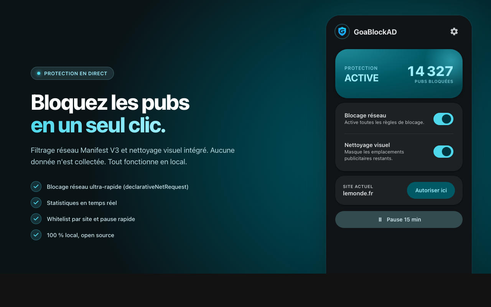
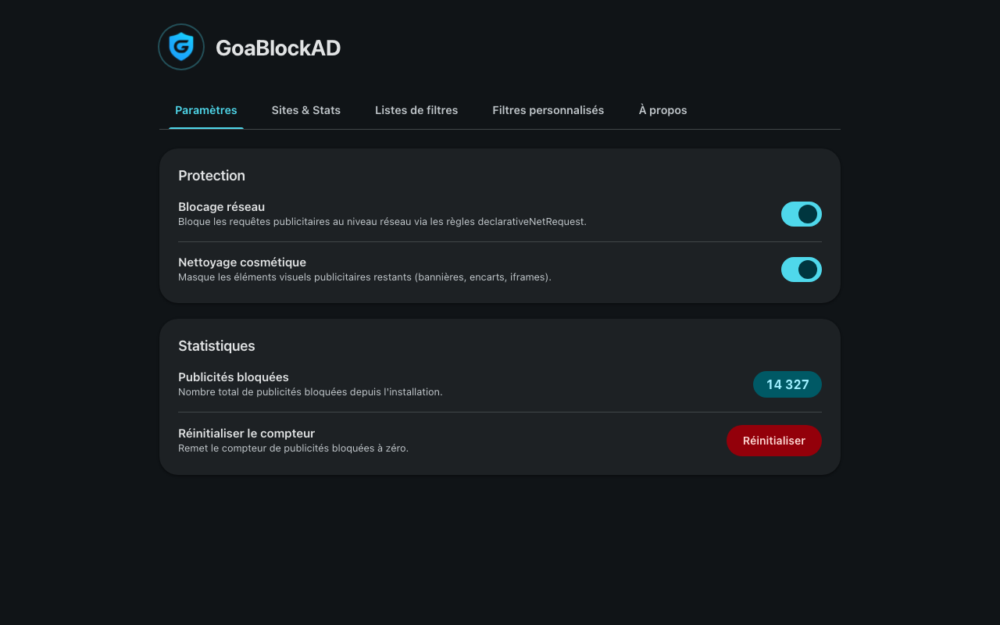

<p align="center">
  
</p>

<h1 align="center">GoaBlockAD</h1>

<p align="center">
  <strong>Fast, private ad blocker for Chrome — built on Manifest V3.</strong>
</p>

<p align="center">
  
  
  
  
  
</p>

---

GoaBlockAD blocks ads at two levels: **network requests** are killed before they load (via `declarativeNetRequest`), and **leftover DOM elements** are hidden with cosmetic filtering. No remote servers, no data collection, no bloat.

<p align="center">
  
  &nbsp;&nbsp;
  
</p>

## Features

- **Network-level blocking** — Requests to Google Ads, Amazon, Criteo, Taboola, Outbrain, and 20+ ad networks are blocked before they reach your browser
- **Cosmetic filtering** — Hides empty ad containers, sticky banners, and overlay placeholders that survive network blocking
- **Real-time stats** — Live counter of blocked ads in the extension badge and popup
- **Dashboard** — View blocked domains, manage filters, customize behavior
- **100% local** — Everything runs in your browser. Zero telemetry, zero external calls
- **Lightweight** — No jQuery, no framework, just vanilla JS + CSS. Extension size under 200KB

## Install

### Chrome Web Store (recommended)

<p align="center">
  <a href="https://chromewebstore.google.com/detail/goablockad/iacipenfiandimlkkcmgafefcjcclhhl">
    
  </a>
</p>

### Manual (developer mode)

```bash
git clone https://github.com/AbrahamOP/GoaBlockAD.git
```

1. Open `chrome://extensions`
2. Enable **Developer mode** (top right)
3. Click **Load unpacked**
4. Select the `GoaBlockAD` folder

### Release ZIP

Download the latest `.zip` from [Releases](https://github.com/AbrahamOP/GoaBlockAD/releases), extract, and load unpacked.

## How it works

```
Browser request → declarativeNetRequest rules (33 patterns)
                    ↓ blocked → never loads
                    ↓ allowed → page renders
                                  ↓
                              content.js scans DOM
                              hides ad containers via content.css
                                  ↓
                              badge counter updated
```

**Blocked networks include**: Google (doubleclick, googlesyndication, googleadservices), Amazon (amazon-adsystem), Facebook (facebook.com/tr), Criteo, Taboola, Outbrain, AppNexus, Rubicon, PubMatic, Index Exchange, and more.

## Tech Stack

| Component | Technology |
|-----------|-----------|
| Extension manifest | Chrome Manifest V3 |
| Ad blocking | `declarativeNetRequest` API |
| Cosmetic filtering | Content script (vanilla JS + CSS) |
| UI | Popup + Dashboard (vanilla HTML/CSS/JS) |
| Storage | `chrome.storage.local` |
| CI/CD | GitHub Actions (auto-release on version bump) |

## Release workflow

Releases are automated. Push a version bump in `manifest.json` to `main`:

```jsonc
// manifest.json
"version": "1.4.0"  // bump this
```

The CI will:
1. Validate JSON and JS syntax
2. Build `GoaBlockAD-v1.4.0.zip` (excluding `.git`, `.github`, `_metadata`)
3. Create a Git tag + GitHub release with auto-generated notes and the ZIP attached

Manual trigger is also available via **Actions → Release → Run workflow**.

## Privacy

GoaBlockAD processes everything locally. It does not:
- Send any data to external servers
- Track your browsing history
- Collect analytics or telemetry
- Require any account or sign-in

See [PRIVACY.md](PRIVACY.md) for the full privacy policy.

## Contributing

Issues and PRs welcome — especially new blocking rules for ad networks not yet covered.

## License

[MIT](LICENSE)
